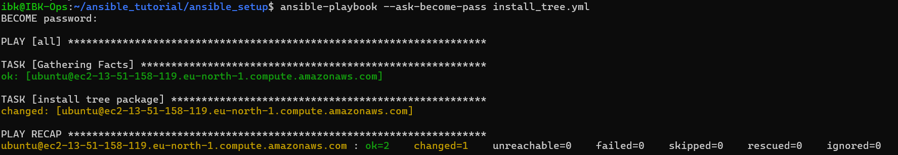

# ansible_setup
Documenting my ansible settup 
Ansible is already installed on my Linux Server
```Bash
sudo apt install ansible
```

## Setting SSH key for Ansible purpose
While setting up the SSH key, trying to connect to my AWS server even though I already had a working SSH setup I tried to set up another SSH. While setting up the SSH I generated another SSH key using 
```bash
ssh-keygen -t ed25519 -C "ansible"
```
After generating this key I loggned into my AWS server then copied the public key insdie ```.ssh/ansible.pub``` into ```~/.ssh/authorixed_keys```. I tried to Access my server using SSH key by runing this command 

```bash
ssh -i .ssh/ansible.pub ubuntu@ec2-000-0.compute.amazonaws.com
```
I kept getting this error message `Load key ".ssh/ansible_rsa.pub": error in libcrypto`

After so many research on this, about 20 min trying to figure out what the issue was I then realised I was using my public key instead of private key 😢 I felt pain and wanted to cry! but we keep building.

so now the correct command is 

```bash
ssh -i .ssh/ansible ubuntu@ec2-000-0.compute.amazonaws.com
```
With this command I am able to login in and out of my Server easily. Now we start our ansible setup

## Connect ansible to our server
I created a folder named ansible_tutorial and cloned this repo (ansible_setup) within the folder. so I will be wokring in the directory ```ansible_tutorial/ansible_setup``` within the folder I created a file named invetory and Insert my server Host name


to confirm our if ansible can access the sever I checke with this command 

```bash
ansible all --key-file ~/.ssh/ansible -i inventory -m ping
```
Got a succesfull responde like this 


In an attempt to reduce typing this bulky line of command everytime I created a config file called ```ansible.cfg``` then specified the invetory fire and the seceret key

Now we can ping our server by using
``` bash
ansible all -m ping
```
Other useful command
``` bash
ansible all --list-hosts #Shows all avaiable host
```

``` Bash
ansible all -m gather_facts #Get info about each server anisble is connected to
```
``` Bash
ansible all -m gather_facts --limit server-IP #Get info about the IP specified
```
## Ansible playBook
I created a `.yml` file within out directory
- Start by write a `---` within our file 
- The begining of a new statement wil start with `-` here is what a playbook that installs tree looks like

- Then we run the ansible-playbook command to install the package across various server 
```bash
ansible-playbook --ask-become-pass install_tree.yml
```
A sucesfull instaltion message


- `state:latest` tells ansible to install latest package
- `state: absent` - uninstalls a package
